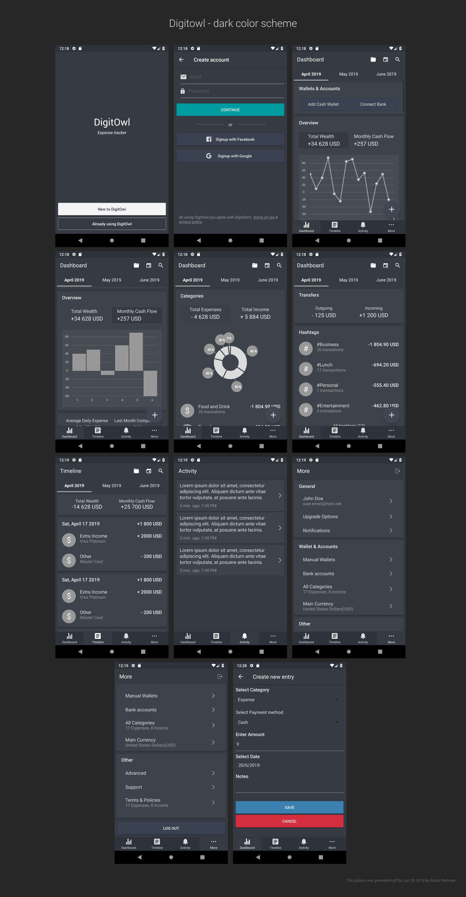

# DigitOwl - Mobile app

This repo contains the source code for the DigitOwl mobile app which is essentially an expense tracking app to help users with their finances.

## Current development status

Currently the UI design is based on the Spendee app and the development process is at the early UI design / prototyping phase. The app currently is static, not connected to any external data source.

Author: *Raziur Rahman, 2019*

## Screenshots




# Development instructions

The code was developed in the following environment:

```
Ubuntu: 16.04
Node.js: 10.15.1
yarn: 1.12.3
React Native: 0.59.5
```

First make sure that you can successfully create & run an empty react native project on your local development environment, using the [React native cli](https://facebook.github.io/react-native/docs/getting-started) & can run it on an Android emulator/device.

Only then attempt to start the development process of this project.

To start the local development process, first clone this repo & you should already have `Node.js`, `yarn`, `react-native` installed globally. Start the android emulator, then run the following commands to start the project on android emulator:

```bash
yarn
yarn start
react-native run-android
```

## Project overview

### Used packages

This project uses some packages/libraries for various purposes, to view the full list of the packages please review the `package.json` file located at the root of the project directory. But here lets review some of the packages that might help you to get your head around the code base & understand how the code is written:

```
react-navigation: Navigating around screens, bottom tabs & others

native-base: UI Components library with theming support

react-native-get-sms-android: Reading SMS on android (planned but not used here yet)

react-native-svg-charts: Charts

react-native-typography: For consistent typography

color: For color manipulation to derive colors from a set of colors.
```

Please go through the packages documentations for in depth information & guidance of how to use those packages in a react native project.

### Project structure

Let review how the code base is organized. When the project was bootstrapped with `react-native-cli`, it created a set of files & folders itself. Besides that, the following directories were created/generated:

```
.
.
├── native-base-theme
├── src
    ├── components
    ├── navigation
    └── screens

```

Most of the project's source code resides in the `src` directory. `native-base-theme` directory was created by native-base for components theme modification. Most the navigation related code is written in `navigation` folder and UI codes written in `components` & `screens` folder.

Some `test` code for react components were written with this naming convention: `*.test.js`, currently basic snapshot testing was carried out for some components & the test codes need to be updated. The `jest` test runner generated `__snapshots__` directories at various levels of the project directories as part of the testing process.

There is a `config.js` file in the `src` directory which is used for project wide shared variables, mostly for color scheme adjustment.
